# Kernel AI-Powered IDE for Mantle

A versatile and production-ready smart contract development environment that redefines the experience of blockchain developers on **Mantle**. Kernel AI combines exceptional speed, security, and intelligence to provide a seamless experience to develop, audit, and deploy smart contracts.

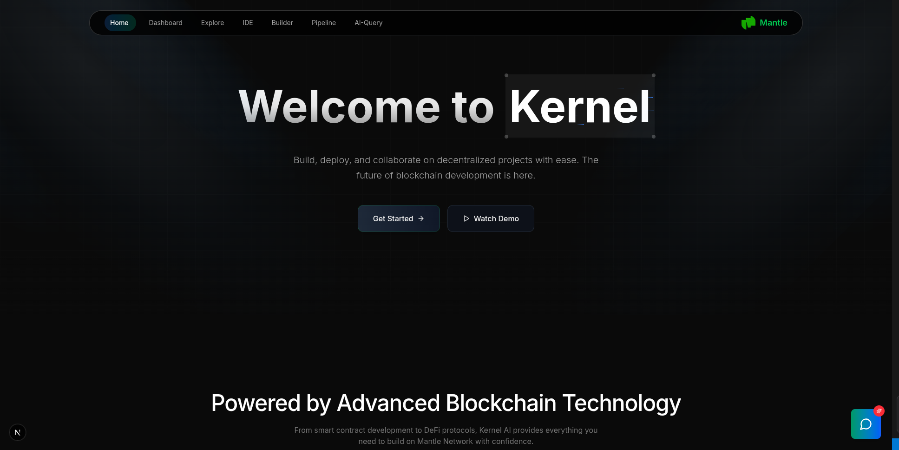

## Table of Contents

- [Introduction](#introduction)
- [Motivation](#motivation)
- [Tech Stack](#tech-stack)
- [Core Features](#core-features)
- [Getting Started](#getting-started)
- [Documentation](#documentation)
- [Contributing](#contributing)
- [License](#license)
- [Contributors](#contributors)

---

## Introduction

Drawing inspiration from leading blockchain development frameworks like Remix, Third Web, and OpenZeppelin Wizard, Kernel is enhanced by finely-tuned AI models to elevate every stage of the development process. With Kernel AI, developers can streamline the entire contract development lifecycle and fast-track their development journey on Mantle Testnet’s cutting-edge infrastructure.

## Motivation

The motivation behind Kernel AI is to address the common challenges faced by smart contract developers in the Mantle ecosystem, such as:

- **Security vulnerabilities** in smart contract code  
- **Complexity of development** on L2/L3 environments  
- **Inefficiencies in the deployment process** for Mantle-based applications  
- **Lack of AI-powered development tools** for the Mantle ecosystem  

By leveraging advanced AI and providing a comprehensive suite of tools specifically designed for **Mantle**, Kernel AI aims to make smart contract development more accessible, secure, and efficient, ultimately fostering innovation and growth within the Mantle blockchain ecosystem.

## Tech Stack

Kernel AI is built using a robust tech stack to ensure performance, reliability, and scalability:

- **Frontend**: Next.js, TypeScript, Tailwind CSS, ShadCn  
- **Smart Contracts**: Solidity  
- **Development Tools**: Resolc Compiler, Zustand, Wagmi, Privy  
- **AI/ML**: Custom trained models, Gemini API integration  
- **Backend**: Next.js, GraphQL  

## Core Features

### 1. Transaction Management Dashboard

A comprehensive dashboard to help users survey all the transactions they made on the Mantle network. The platform provides efficient AI analysis of transaction patterns, network activity, and detailed insights into your blockchain interactions with visual charts and real-time monitoring capabilities.

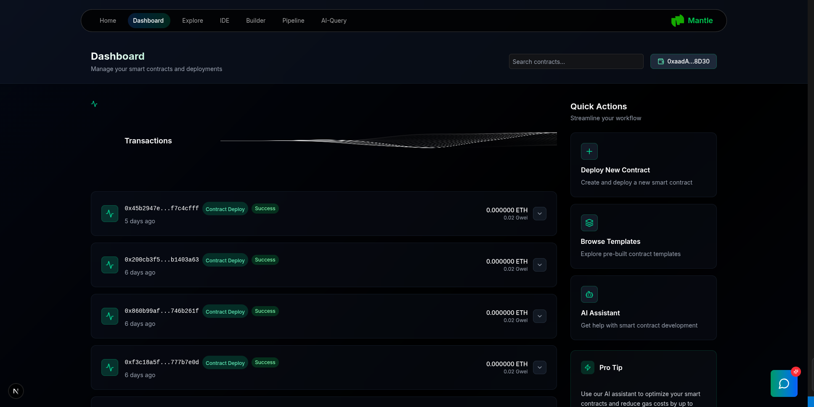

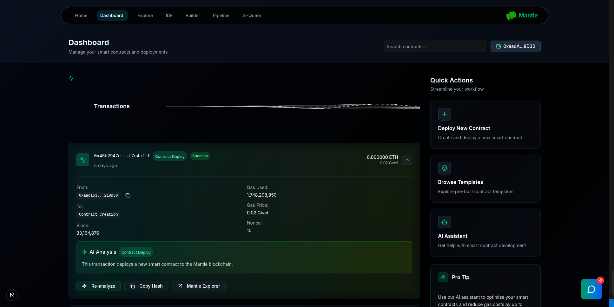

### 2. Conversational AI

Interactive AI assistant that provides 24/7 development support through natural language processing. The assistant understands your Mantle-specific project context and helps with coding, debugging, and answering development questions.

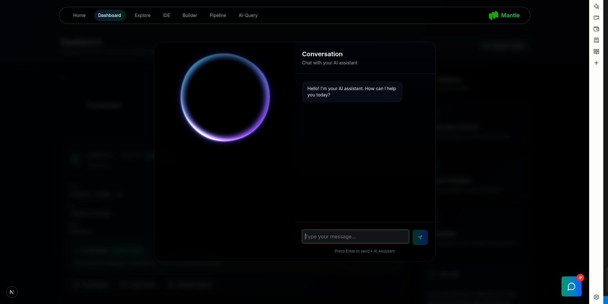

### 3. AI-Powered Ready-to-Use Templates

Provision of AI-enhanced smart contract templates optimized for **Mantle**. These come with pre-built, secure foundations for rapid deployment on the Mantle chain.


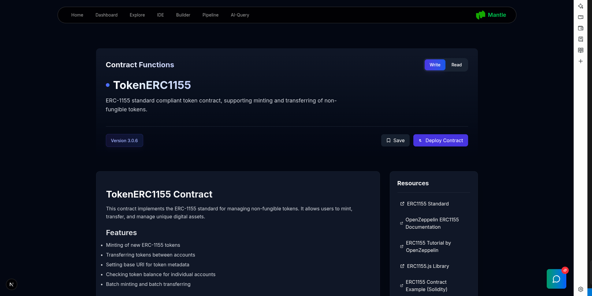

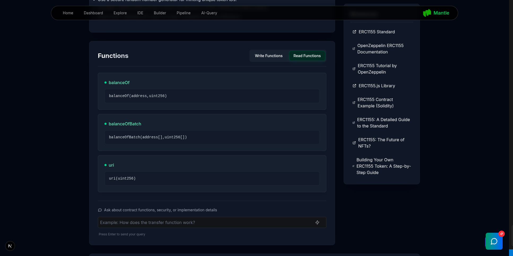


### 4. Interactive Smart Contract Builder

A scratch-like drag-and-drop interface for smart contract development that lowers the barrier for beginners on the Mantle platform.

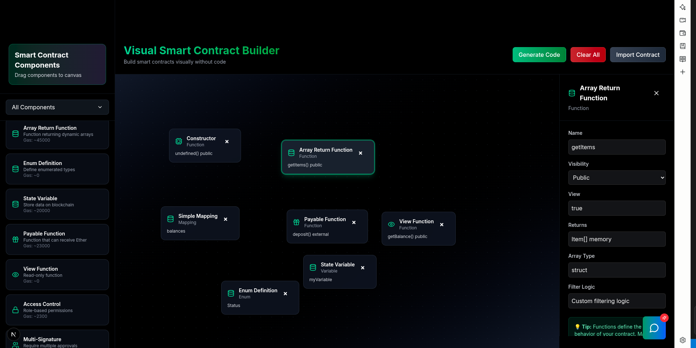

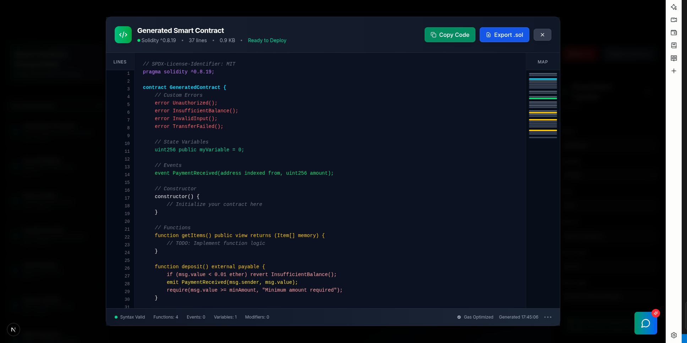

### 5. AI IDE

A smart, AI-powered IDE optimized for Solidity contracts targeting **Mantle**. Supports live error checking, auto-complete, optimization suggestions, and direct deployment.

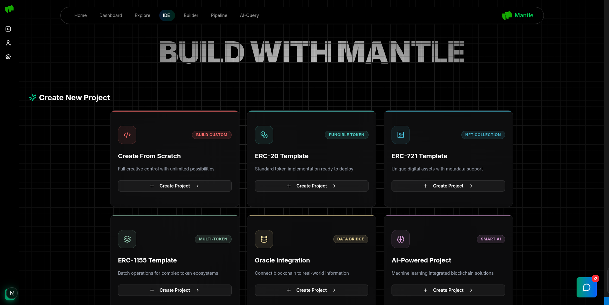

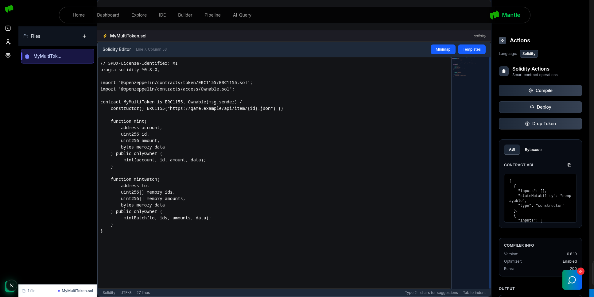

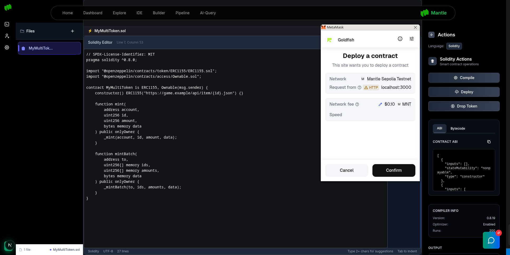

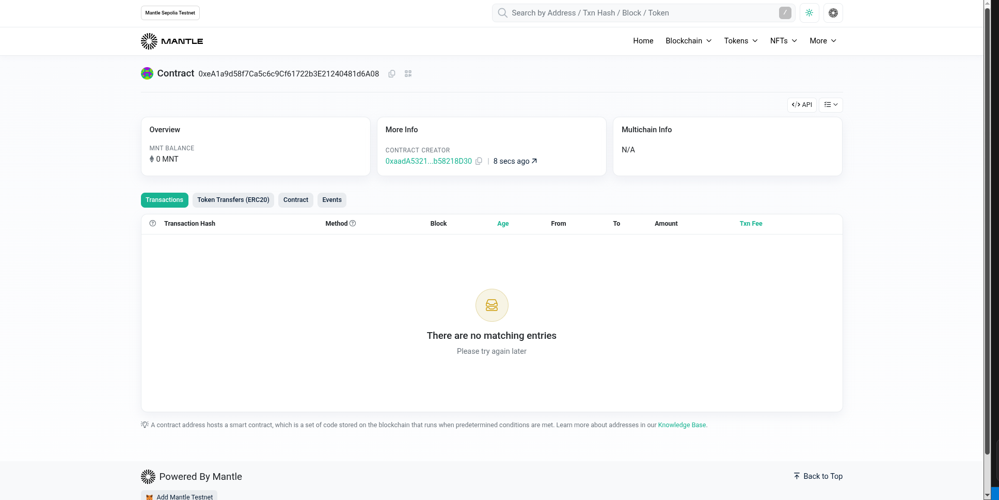

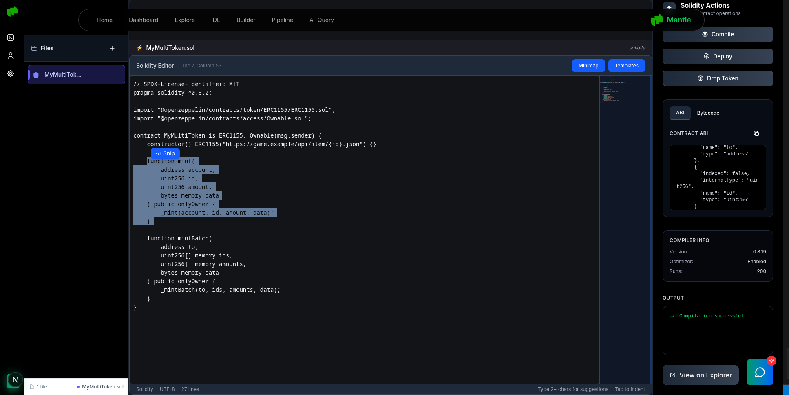

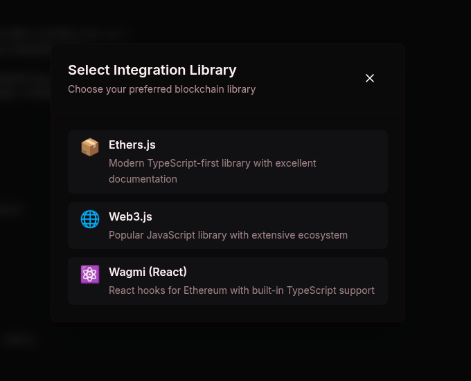

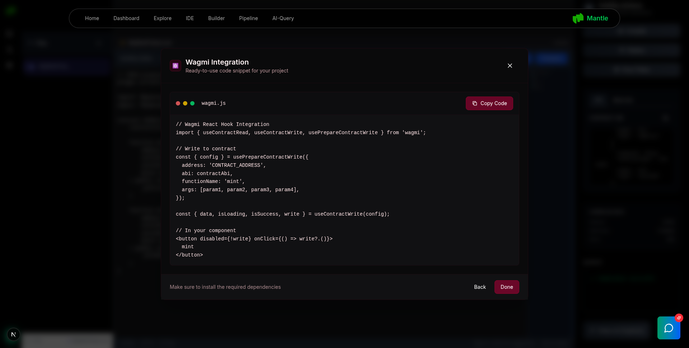


### 6. AI-Catered Auditor

Integrated AI-powered contract auditing system tailored for **Mantle** deployments, detecting vulnerabilities and recommending fixes.

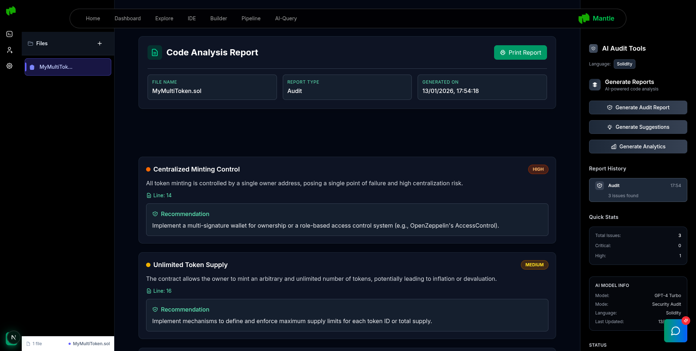


### 7. AI-Generated Tests

Instantly generate test cases for smart contracts deployed on **Mantle**, with support for testing frameworks like Viem, Hardhat, and Foundry.

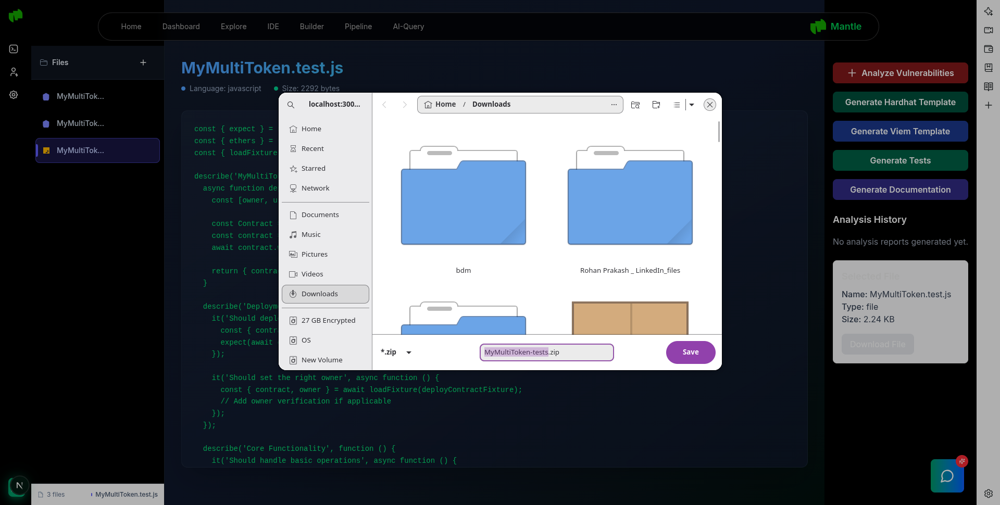

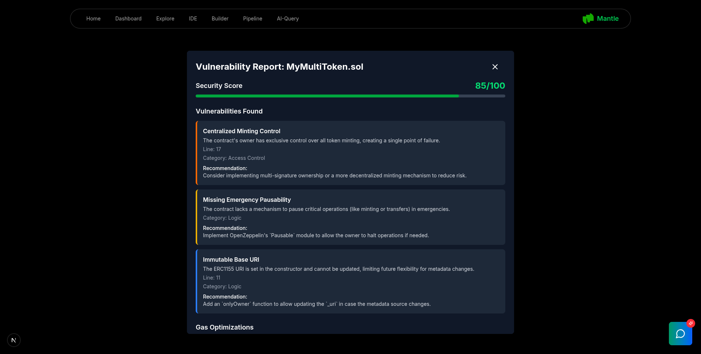


### 8. Natural Language Contract Interaction

Talk to your deployed Mantle contract in plain English. ABI + contract address is all you need to run functions or view state.


### 9. Node Deployment Pipeline

Drag-and-drop your way to full deployment workflows on **Mantle**, including automated testnet/mainnet pipelines.

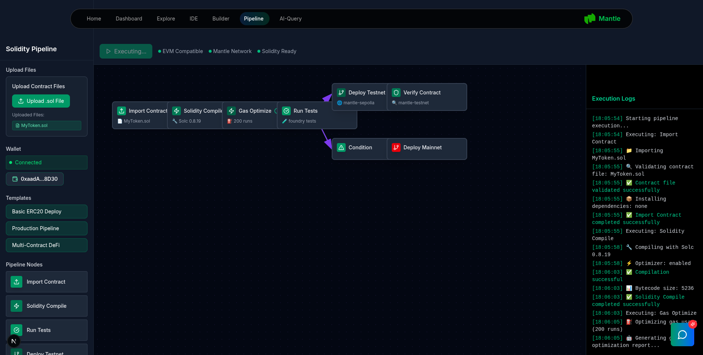

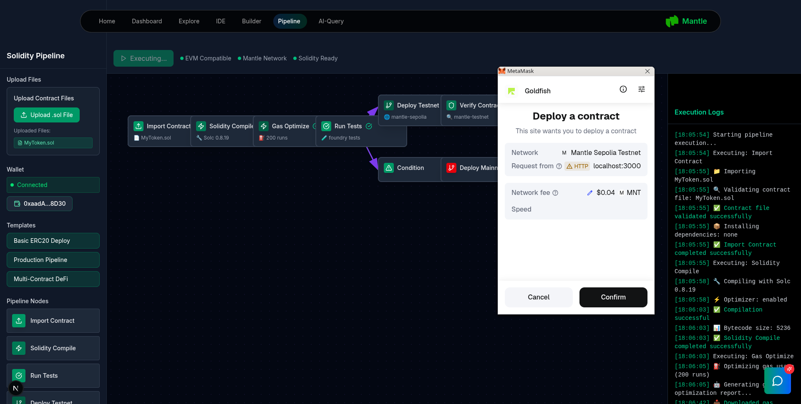

### 10. AI Frontend Generation with Direct Deployment

Instantly generate a full-featured, responsive React/Next.js frontend for your deployed smart contract. The AI analyzes your contract's ABI to create a tailored UI for interacting with all functions—ready to be deployed to Vercel with a single click.
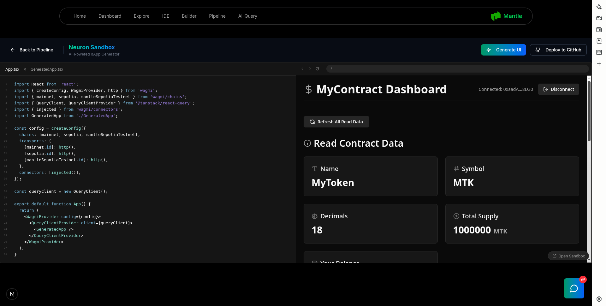


## Getting Started

### Prerequisites

Before you begin, ensure you have the following installed:
- Node.js (v18 or higher)  
- Rust and Cargo  
- Mantle-compatible local/test node or provider  
- Docker (optional)

### Installation

1. Clone the repository:
   ```bash
   git clone https://github.com/your-org/kernel-ai.git
   cd kernel-ai
   ```

2. Install dependencies:
   ```bash
   npm install
   ```

3. Set up environment variables:
   ```bash
   cp .env.example .env
   # Configure your environment variables
   ```

4. Start the development server:
   ```bash
   npm run dev
   ```

## Documentation

Comprehensive documentation is available in the `/docs` directory, including:
- API Reference
- Development Guide
- Deployment Instructions
- Security Best Practices
- Template Library Documentation

## Contributing

We welcome contributions from the Mantle community! Please read our [Contributing Guidelines](CONTRIBUTING.md) before submitting pull requests.

### Development Workflow

1. Fork the repository
2. Create a feature branch (`git checkout -b feature/amazing-feature`)
3. Commit your changes (`git commit -m 'Add amazing feature'`)
4. Push to the branch (`git push origin feature/amazing-feature`)
5. Open a Pull Request

### Code Standards

- Follow TypeScript and React best practices
- Maintain consistent code formatting using Prettier
- Write comprehensive tests for new features
- Document all public APIs and components

## License

This project is licensed under the MIT License - see the [LICENSE](LICENSE) file for details.

## Contributors

The following individuals have contributed to this project:


### **Rakshit Shukla**
**Role**: Blockchain Developer  
**Responsibilities**: Developing smart contract templates, integrating Mantle functionalities such as code compilation, deployment and testing, developing security features and dynamic import resolution protocols for Solidity contracts utilizing resolc compiler.


---

## Support

For support, questions, or feature requests:
- Create an issue on GitHub
- Join our community Discord
- Email us at support@kernel-ai.dev

---

*Kernel - Empowering developers to build the future of decentralized applications on Mantle Testnet*

