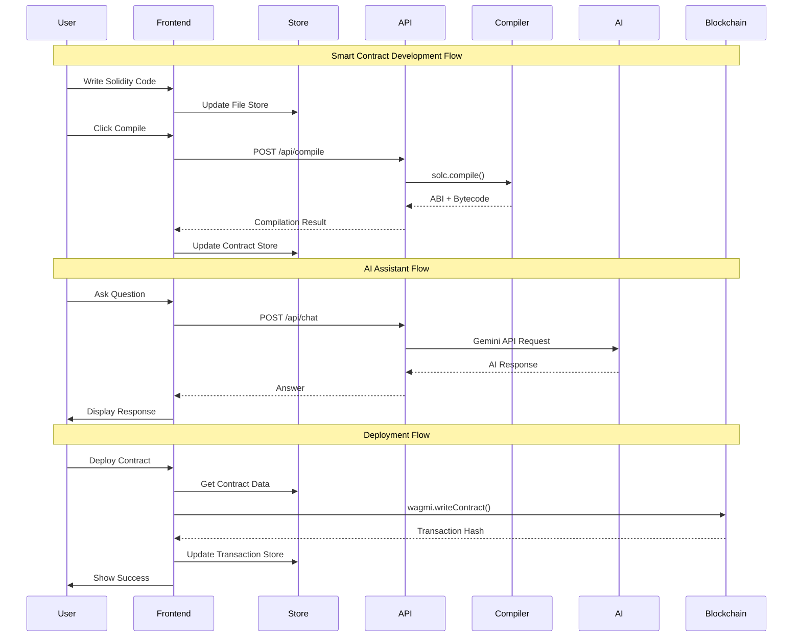
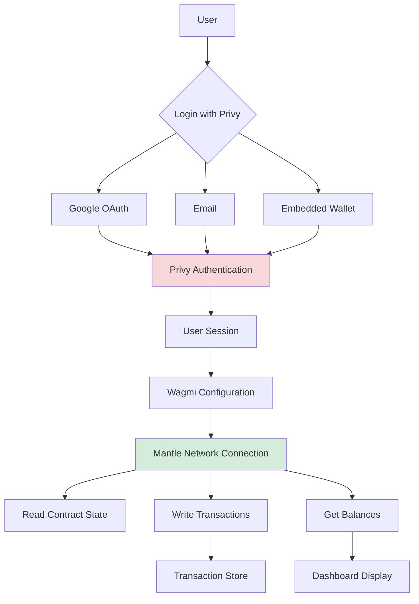

# Kernel AI - System Architecture

## Overview

**Kernel AI** (formerly Kernel Morph) is a comprehensive AI-powered Web3 development platform built for the **Mantle Network**. It provides a full-stack smart contract development environment with AI-enhanced features including an IDE, visual contract builder, security auditing, and natural language interaction capabilities.

## Architecture Diagram

### High-Level System Architecture

```mermaid
graph TB
    subgraph "Client Layer"
        Browser[Web Browser]
    end
    
    subgraph "Frontend - Next.js 15"
        Landing[Landing Page]
        Dashboard[Dashboard]
        IDE[AI IDE]
        Pipeline[Pipeline Builder]
        NLP[NLP Interface]
        Explore[Templates Explorer]
        Sandbox[Neuron Generator]
        
        subgraph "UI Components"
            Editor[Monaco Editor]
            CodeEditor[Code Editor]
            FileNav[File Navigator]
            TransList[Transaction List]
            AuditUI[Audit Components]
            Modals[Modal Components]
        end
        
        subgraph "State Management - Zustand"
            ContractStore[Contract Store]
            FileStore[File Store]
            TxStore[Transaction Store]
        end
    end
    
    subgraph "API Layer - Next.js API Routes"
        CompileAPI[/api/compile]
        ChatAPI[/api/chat]
        ExploreAPI[/api/explore]
        TxAPI[/api/transactions]
    end
    
    subgraph "External Services"
        Gemini[Gemini AI API]
        Mantle[Mantle Network]
        Privy[Privy Auth]
    end
    
    subgraph "Smart Contracts & Templates"
        Contracts[Solidity Contracts]
        OZ[OpenZeppelin Libraries]
        Templates[Contract Templates]
    end
    
    subgraph "Compilation & Tools"
        Solc[Solc Compiler]
        Resolc[Resolc Compiler]
        Viem[Viem]
        Wagmi[Wagmi]
    end
    
    Browser --> Landing
    Browser --> Dashboard
    Browser --> IDE
    Browser --> Pipeline
    Browser --> NLP
    Browser --> Explore
    Browser --> Sandbox
    
    IDE --> Editor
    IDE --> CodeEditor
    IDE --> FileNav
    Dashboard --> TransList
    IDE --> AuditUI
    
    Landing --> ContractStore
    IDE --> ContractStore
    Pipeline --> ContractStore
    Dashboard --> TxStore
    IDE --> FileStore
    
    IDE --> CompileAPI
    Landing --> ChatAPI
    Dashboard --> ChatAPI
    Explore --> ExploreAPI
    Dashboard --> TxAPI
    NLP --> ChatAPI
    
    CompileAPI --> Solc
    CompileAPI --> Resolc
    CompileAPI --> Contracts
    CompileAPI --> OZ
    
    ChatAPI --> Gemini
    ExploreAPI --> Templates
    
    IDE --> Wagmi
    NLP --> Wagmi
    Dashboard --> Wagmi
    Wagmi --> Viem
    Wagmi --> Privy
    
    Viem --> Mantle
    Privy --> Browser
    
    style Browser fill:#e1f5ff
    style Gemini fill:#fff3cd
    style Mantle fill:#d4edda
    style Privy fill:#f8d7da
```

### Component Architecture

```mermaid
graph LR
    subgraph "Pages"
        P1[/ - Landing]
        P2[/dashboard - Analytics]
        P3[/ide - AI IDE]
        P4[/pipeline - Visual Builder]
        P5[/nlp - NLP Interface]
        P6[/explore - Templates]
        P7[/sandbox - UI Generator]
    end
    
    subgraph "Shared Components"
        C1[Navbar]
        C2[Footer]
        C3[ConnectWallet]
        C4[NeuronAssistant]
    end
    
    subgraph "Feature Components"
        F1[CodeEditor]
        F2[FileNavigator]
        F3[EditorSidebar]
        F4[TransactionList]
        F5[AuditReport]
        F6[ContractCard]
        F7[PluginManager]
    end
    
    subgraph "UI Library - ShadCN"
        U1[Button]
        U2[Card]
        U3[Dialog]
        U4[Input]
        U5[Tabs]
    end
    
    P1 --> C1
    P2 --> C1
    P3 --> C1
    P4 --> C1
    P5 --> C1
    P6 --> C1
    P7 --> C1
    
    P1 --> C4
    P2 --> C4
    P3 --> C4
    
    P3 --> F1
    P3 --> F2
    P3 --> F3
    P2 --> F4
    P3 --> F5
    P6 --> F6
    P3 --> F7
    
    F1 --> U1
    F2 --> U2
    F5 --> U3
    C3 --> U1
    
    style P3 fill:#e3f2fd
    style P4 fill:#e3f2fd
    style P5 fill:#e3f2fd
```

### Data Flow Architecture



### Authentication & Wallet Flow



## Technology Stack

### Frontend
- **Framework**: Next.js 15 (React 19)
- **Language**: TypeScript 5
- **Styling**: Tailwind CSS 4
- **UI Components**: ShadCN UI (Radix UI primitives)
- **State Management**: Zustand
- **Code Editor**: Monaco Editor
- **Animations**: Framer Motion, GSAP
- **3D Graphics**: Three.js, Spline, Cobe

### Web3 Integration
- **Wallet Connection**: Privy Auth (v2.13.6)
- **Contract Interaction**: Wagmi (v2.15.4)
- **Ethereum Client**: Viem (v2.30.6)
- **Network**: Mantle Sepolia Testnet (Chain ID: 5003)

### Backend & APIs
- **API Routes**: Next.js API Routes (App Router)
- **Solidity Compilation**: solc (v0.8.30)
- **Alternative Compiler**: @parity/resolc (v0.1.0-dev.16)
- **AI Integration**: Gemini 2.5 Flash API
- **HTTP Client**: Axios

### Development Tools
- **Code Sandbox**: @codesandbox/sandpack-react
- **Syntax Highlighting**: react-syntax-highlighter
- **File Handling**: jszip
- **Icons**: Lucide React, Tabler Icons, React Icons

### Smart Contracts
- **Language**: Solidity ^0.8.0
- **Libraries**: OpenZeppelin Contracts
- **Testing**: Viem (browser-based testing)

## Key Features Architecture

### 1. AI-Powered IDE (`/ide`)
**Components**: `CodeEditor`, `MonacaEditor`, `FileNavigator`, `EditorSidebar`, `PluginManager`
**State**: `fileStore`, `contractStore`
**APIs**: `/api/compile`, `/api/chat`
**Features**:
- Real-time Solidity editing with Monaco
- AI-powered code suggestions
- Integrated compilation using solc
- Deployment to Mantle Network
- Security auditing

### 2. Visual Pipeline Builder (`/pipeline`)
**Components**: Custom drag-drop nodes
**State**: `contractStore`
**Features**:
- Node-based visual contract construction
- Storage, Events, Access Control nodes
- Real-time code generation
- Export to Solidity

### 3. Natural Language Interface (`/nlp`)
**Components**: Chat interface, transaction builder
**APIs**: `/api/chat`
**Web3**: Wagmi for contract interaction
**Features**:
- Plain English contract interaction
- AI-powered command parsing
- Direct transaction execution
- ABI-based function calls

### 4. Transaction Dashboard (`/dashboard`)
**Components**: `TransactionList`, analytics charts
**State**: `transactionStore`
**APIs**: `/api/transactions`
**Features**:
- Transaction history tracking
- Network activity analytics
- AI pattern analysis
- Real-time monitoring

### 5. AI Security Auditor (IDE Integration)
**Components**: `AuditReport`, `AuditSidebar`, `PrintStyles`
**APIs**: `/api/chat` (Gemini analysis)
**Features**:
- Vulnerability scanning
- Real-time security feedback
- AI-powered recommendations
- Exportable audit reports

### 6. Contract Templates Explorer (`/explore`)
**Components**: `ContractCard`
**APIs**: `/api/explore`
**Data**: Pre-built templates in `/src/data/contracts`
**Features**:
- Ready-to-use contract templates
- ERC-20, ERC-721, ERC-1155 standards
- OpenZeppelin integration
- One-click deployment

### 7. Neuron UI Generator (`/sandbox`)
**Components**: Sandpack integration
**APIs**: `/api/chat` (code generation)
**Features**:
- AI-generated dApp UIs
- Live preview
- Code export
- Template customization

## State Management

### Zustand Stores

#### Contract Store (`contractStore.ts`)
```typescript
interface Contract {
  address: string
  name: string
  description: string
  version: string
  abi: string
  content: string
  language: string
}
```
**Purpose**: Manages deployed and compiled contracts

#### File Store (`fileStore.ts`)
**Purpose**: Manages IDE file system state

#### Transaction Store (`transactionStore.ts`)
**Purpose**: Tracks user transactions on Mantle Network

## API Endpoints

### `/api/compile` (POST)
**Input**: 
- `sources`: Object with Solidity files
- `solidityFilePath`: Alternative file path
- `saveFiles`: Boolean for artifact saving

**Output**:
- `contracts`: Compiled ABIs and bytecode
- `warnings`: Compilation warnings
- `error`: Error messages if failed

**Process**:
1. Resolve OpenZeppelin imports
2. Compile with solc
3. Validate bytecode
4. Return ABI + bytecode

### `/api/chat` (POST)
**Input**: `{ question: string }`

**Output**: `{ response: string }`

**Process**:
1. Build system context (platform features)
2. Send to Gemini API
3. Return AI-generated response

### `/api/explore` (GET)
**Output**: List of contract templates

### `/api/transactions` (GET/POST)
**Purpose**: Transaction tracking and analytics

## Network Configuration

### Mantle Sepolia Testnet
- **Chain ID**: 5003
- **RPC URL**: https://rpc.sepolia.mantle.xyz
- **Explorer**: https://sepolia.mantlescan.xyz
- **Currency**: MNT (18 decimals)
- **Type**: Testnet

## Security Features

1. **AI-Powered Auditing**: Real-time vulnerability detection using Gemini AI
2. **Compilation Validation**: Bytecode verification and validation
3. **Privy Authentication**: Secure wallet and OAuth integration
4. **Type Safety**: Full TypeScript implementation
5. **Import Resolution**: Secure dependency resolution for OpenZeppelin

## Deployment Architecture

### Development
```
npm run dev → Next.js Dev Server (Port 3000)
```

### Production
```
npm run build → Static optimization + API routes
npm start → Production server
```

### Environment Variables
- `NEXT_PUBLIC_GEMINI_API_KEY`: Gemini AI API key
- Additional Privy & Mantle configuration

## File Structure

```
kernel-morph/
├── contracts/              # Solidity smart contracts
├── openzeppelin/          # OpenZeppelin library contracts
├── src/
│   ├── app/               # Next.js App Router pages
│   │   ├── api/          # API routes
│   │   ├── dashboard/    # Transaction dashboard
│   │   ├── ide/          # AI IDE
│   │   ├── pipeline/     # Visual builder
│   │   ├── nlp/          # NLP interface
│   │   ├── explore/      # Template explorer
│   │   └── sandbox/      # UI generator
│   ├── components/        # React components
│   │   ├── audit/        # Audit UI
│   │   ├── editor/       # IDE components
│   │   ├── ui/           # ShadCN components
│   │   └── modals/       # Modal dialogs
│   ├── stores/           # Zustand state stores
│   ├── data/             # Contract templates & data
│   ├── types/            # TypeScript definitions
│   ├── config/           # Wagmi & chain config
│   └── utils/            # Utility functions
├── public/               # Static assets
└── package.json          # Dependencies
```

## Data Flow Patterns

### Contract Compilation Flow
1. User writes Solidity in Monaco Editor
2. File state stored in Zustand `fileStore`
3. User clicks "Compile"
4. Frontend sends code to `/api/compile`
5. API resolves imports (OpenZeppelin, etc.)
6. solc compiles and returns ABI/bytecode
7. Results stored in `contractStore`
8. UI displays compilation results

### AI Interaction Flow
1. User asks question in NeuronAssistant
2. Frontend sends to `/api/chat`
3. API builds context with platform info
4. Gemini API processes request
5. Response streamed back to user
6. Display in chat interface

### Contract Deployment Flow
1. User selects compiled contract
2. Frontend reads from `contractStore`
3. Wagmi initiates transaction via Privy
4. User confirms in wallet
5. Transaction sent to Mantle Network
6. Hash stored in `transactionStore`
7. Dashboard updated with new transaction

## Scalability Considerations

- **Code Splitting**: Next.js automatic code splitting per route
- **State Optimization**: Zustand for minimal re-renders
- **API Caching**: Next.js API route caching
- **Component Lazy Loading**: Dynamic imports for heavy components (Monaco, Three.js)
- **Edge-Ready**: Can deploy to Vercel Edge for global distribution

## Future Architecture Enhancements

1. **WebSocket Integration**: Real-time compilation feedback
2. **Indexed Database**: Browser-based contract storage
3. **Multi-Chain Support**: Extend beyond Mantle
4. **Collaborative Editing**: Real-time multiplayer IDE
5. **Advanced Analytics**: GraphQL for complex queries
6. **Microservices**: Separate compilation service
7. **IPFS Integration**: Decentralized contract storage

---

**Last Updated**: January 2026  
**Version**: 1.0  
**Project**: Kernel AI (Neuron AI) - Mantle Network Development Platform
